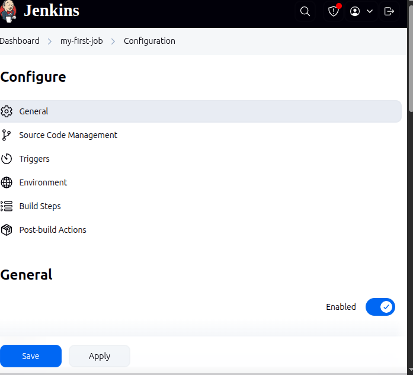
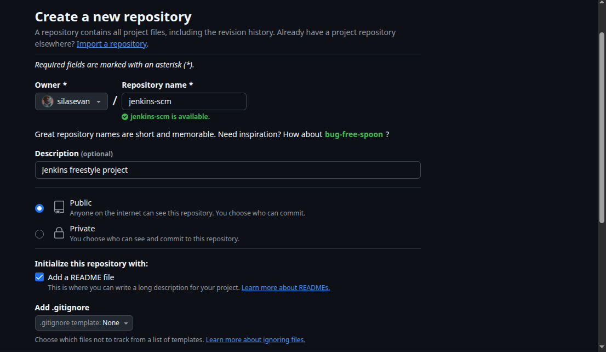
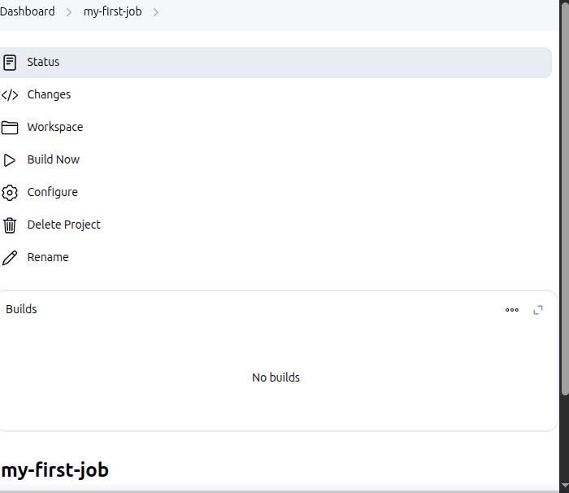
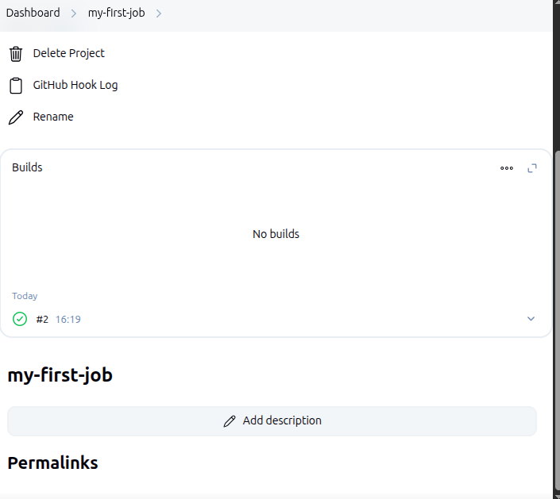
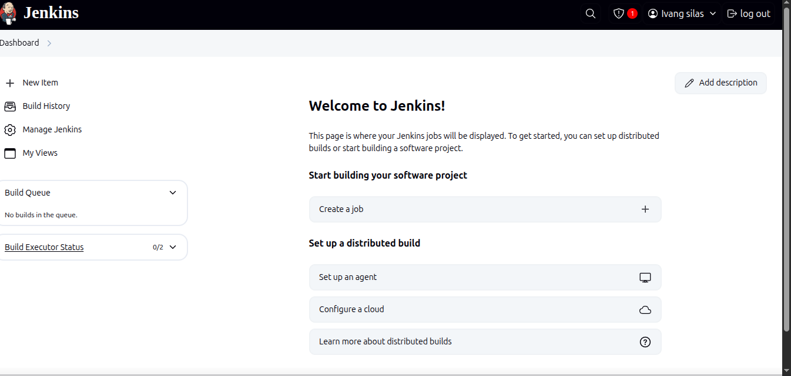

# # Building a Freestyle Project in Jenkins

This guide outlines the steps for creating and configuring a Freestyle project in Jenkins, including how to automatically trigger builds when changes are pushed to a GitHub repository.

---

## 🚀 Project Overview

- **Project Type:** Jenkins Freestyle Project
- **Source Control:** GitHub
- **Build Trigger:** GitHub Webhook (on code push)
- **Platform:** Jenkins running locally on Linux Mint XFCE

---

## 📁 Prerequisites

- Jenkins is installed and running (`http://localhost:8080`)
- Git and Java are installed
- GitHub repository is available
- Jenkins has internet access
- GitHub Plugin is installed in Jenkins (Manage Jenkins > Plugins)

---

## 🛠️ Steps to Build a Freestyle Project

### 1. Open Jenkins
Navigate to:
http://localhost:8080


### 2. Create a New Freestyle Project
- Click **"New Item"**
- Enter a project name (e.g., `my-freestyle-build`)
- Select **"Freestyle project"**
- Click **OK**

---

## ⚙️ Configure the Project

### General
Optionally add a project description.

### Source Code Management
- Select **Git**
- Enter your GitHub repository URL (e.g., `https://github.com/username/repo.git`)
- Add credentials if the repo is private

### Build Triggers
Check the option:
- ✅ **Build when a change is pushed to GitHub**

> Note: This requires a GitHub webhook to be configured.

### Build Steps
- Click **"Add build step"**
- Select **"Execute shell"**
- Example shell command:
  ```bash
  echo "Cloning repository..."
  git rev-parse HEAD
  echo "Build complete."


### Screenshots




